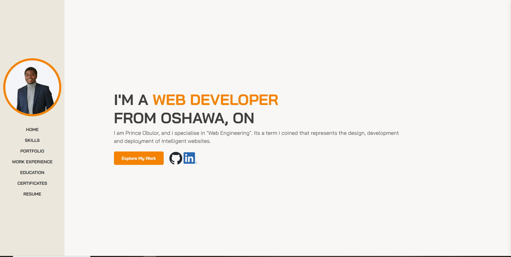

# personal-portfolio
This repository contains my personal portfolio. 

### REPOSITORY DESCRIPTION

REPOSITORY NAME: portfolio-rebuild

This repository is created for Assignment 8: Final Portfolio
It contains and index.html, script.js, style.css accordingly.

### SCREENSHOT

### RELATED LINKS
[Github repository:](https://github.com/Prince-grandev)

[Github application:](https://prince-grandev.github.io/personal-portfolio/)

### BRIEF INTRODUCTION
This was a rather interesting project and defintely tested my knowledge of syntax as well as problem solving.

### CONCLUSION
The exercise was brilliant and definitely incentivised doing more reading and research.

### CREDITS
[Reference Tutorial](https://www.youtube.com/redirect?event=comments&redir_token=QUFFLUhqbEVTaXNzeHNjalZ4ODMyLXlPNW9HSkdBa1JwUXxBQ3Jtc0trd3VLczNLQUV6YVhyUVlfd24xM21QbjEzLTY3UzBYcWozRV9Cek1sdmYwVnMxaVdpTFBrUXhWazZENDJtdllWZi1FZXBlcDRtcGVhdXVZdUNvV2hHOGJITk92SGVEREFEb2gwRjZMNFNEMkFtUldDYw&q=https%3A%2F%2Fgithub.com%2FSA7MANKHAN%2Fjoncarter-portfolio)git add